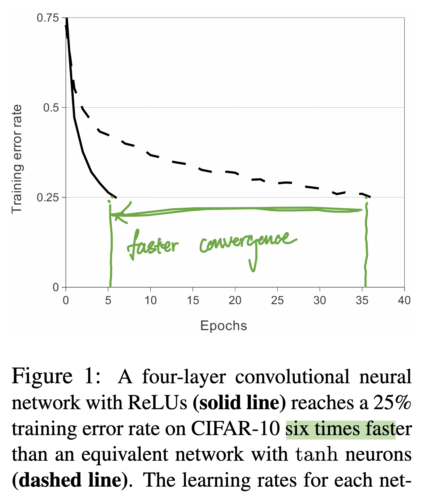

# ImageNet Classification with Deep Convolutional Neural Networks

## 📋 Basic Information
- **Authors**: Alex Krizhevsky, Ilya Sutskever, Geoffrey E. Hinton
- **Year**: 2012
- **Venue**: NeurIPS (NIPS)
- **Link**: [PDF](https://proceedings.neurips.cc/paper_files/paper/2012/file/c399862d3b9d6b76c8436e924a68c45b-Paper.pdf)

## 1. 📖 Paper Understanding

### The Problem

> What problem does this paper solve?
**scale** -> "to learn thousands of object, we need model with larger learning capability"

> Prior art and why they didn't work well:
- no large scale data -> which only became available when imagenet came out

> Related work:

### The Key Idea
> High-level approach to solving the problem:
CNN is parameter efficent thus easiler to train, and capture local feature.

### The Challenge
> What are the main challenges in solving this problem?
-  CNN is still prohibiitively expensive to apply in large scale for high resolution images
- how to prevent overfitting?

### The Method
> Brief overview (detailed analysis in Section 2):
- 8 layers: 5 conv + 3 fully connected

### Pros & Cons
> Strengths:

> Weaknesses/Limitations:

### Impact & Contributions
> Key contributions to the field:
  - First successful application of deep CNNs to large-scale image classification
  - Demonstrated the power of end-to-end learning for computer vision
  - Popularized ReLU activation functions
  - Showed effectiveness of dropout regularization

The vison: "all exp. suggests that alexnet can be improved with faster GPU and bigger dataset.". Which turn out to be ture.

> How did this paper change the field after its release?

### [Optional] Background & History
- **Useful background knowledge:**
  - Convolutional Neural Networks (LeCun et al., 1998)
  - ImageNet dataset and competition
  - GPU computing for deep learning
  - Backpropagation and gradient descent

#### **Pre-history and context:**
  - Computer vision was dominated by hand-engineered features
  - Neural networks were considered impractical for large-scale problems
  - Limited computational resources prevented training deep networks

I found this talk to be very insightful [https://youtu.be/Z7naK1uq1F8?feature=shared](https://youtu.be/Z7naK1uq1F8?feature=shared) Feifei's talk on the human story behind imagenet, & why she believed imagenet is needed.
- Vision is an important human capability, 40% of the human brain neuron is related to vision.
- Before imagenet, classification are done on 20+ labels. But human can recongize 30k categories by age six. Fitting model on 20 labels is foundamentally off from real human capability.
- Thus we need imagenet (millions of object), but, scaling human annotation is challenging (so true). 
- Imagenet became the benchmark (with competitions) in visions, which is what AlexNet participated in.

***

## 2. 🔬 Key Technical Details

### Deep Method Understanding
- **How does the method work in detail?**

- **Key algorithms and techniques:**
1. ReLu
- previous activation method: tanh or sigmoid 
  - tanh activations can saturate when inputs become large or very negative, outputting values close to -1 or 1. In these saturated regions, the gradients become very small (close to zero), causing the vanishing gradient problem.
- ReLu reach 6x faster convergence than tanh on CIFAR -> faster learning enable training of a large network
- without ReLU, it'd not been possible (training speed) to train a large network
- ReLU has a constant gradient of 1 for positive inputs, which maintains strong gradient signals and helps avoid the problem of vanishing gradient

2. Multi-GPU accerlation
- use 2 GTX350 GPU (3GB memory)
 

- GPU for NN training is a known technique before alexnet and shown 10-60x speedup from the IDSIA group
  - What's special about AlexNet using GPU is **scale of data**
  - AlexNet was much deeper and larger (60M parameters, 8 layers) than previous CNNs. It needed the GPU not just for speed, but for feasibility.

### Case Studies & Examples
- **Specific examples and implementations:**

### Technical Insights
- **Deep technical understanding and nuances:**

## ❓ Personal Questions to Answer
- **What did I learn from this paper?**
  - 

- **What questions do I still have?**
  - 

- **How does this relate to other papers I've read?**
  - 

- **What would I do differently if I were to implement this?**
  - 

## 📚 References
- Krizhevsky, A., Sutskever, I., & Hinton, G. E. (2012). ImageNet classification with deep convolutional neural networks. Advances in neural information processing systems, 25.
- LeCun, Y., Bottou, L., Bengio, Y., & Haffner, P. (1998). Gradient-based learning applied to document recognition. Proceedings of the IEEE, 86(11), 2278-2324.

## Background Concepts: Backprop
1. Historical and Contextual Background
- Early Neural Networks (1940s–1960s):
In the 1950s–1960s, Rosenblatt introduced the perceptron, an early learning algorithm. However, perceptrons were limited: they could only solve linearly separable problems (like AND/OR) but not nonlinear ones (like XOR). -> backprop doesn't work here.
- Backprop doesn't work here is due to architectural limitation of perceptron (single layer network)
   1. Non-differentiable Activation: no meaningful gradient (derivative is zero almost everywhere). Backprop requires smooth, differentiable activations (like sigmoid, tanh, ReLU) to propagate error signals.
   2. Too Simple Architecture: Even if you replaced the step function with a smooth activation, a single-layer perceptron is still limited to linear separation. Backprop wouldn’t “fix” that — it would just converge to the best linear boundary possible.

2. The Problem of Training Multi-layer Networks:
Researchers realized that more complex networks (multi-layer perceptrons, MLPs) could, in principle, represent more sophisticated functions. The challenge was how to efficiently train them. Early attempts relied on brute-force or biologically inspired methods, but none scaled well.
   - Brute-force “finite difference” methods: Perturb each weight slightly, measure the effect on the loss, and approximate the gradient numerically. This requires two forward passes per weight. For networks with thousands (today, billions) of weights, this is computationally impossible.
   - Random search / evolutionary methods: Adjust weights randomly and keep changes if performance improves. Works for tiny networks but becomes exponentially slower as networks grow.
   - Layer-by-layer heuristics: Train one layer at a time (e.g., unsupervised methods for hidden layers, then train the output layer). This avoids dealing with full gradients, but doesn’t reliably optimize the whole network.
   - Biologically inspired “Hebbian learning”: “Neurons that fire together wire together” — local update rules. Intuitively plausible, but not aligned with minimizing a global error signal in deep, multi-layer systems.

3. Backpropagation Emerges (1970s–1980s):
The algorithm we now call backpropagation was independently discovered multiple times. The key milestones were:
   - Paul Werbos (1974) first described using the chain rule for training multi-layer networks in his PhD thesis.
   - David Rumelhart, Geoffrey Hinton, and Ronald Williams popularized backpropagation in their influential 1986 paper, showing it could effectively train deep neural networks.

source: [link](https://chatgpt.com/s/t_68b39ccaa58c8191b72a523beb1d0baf)

### Backprop
application of the chain rule of calculus to compute gradients efficiently in multi-layer neural networks.

1. Forward Pass:
  - Input data flows through the network layer by layer.
  - Each neuron applies a weighted sum and an activation function.
  - At the output layer, the network produces predictions, and the loss function compares these with the true labels.

2. Backward Pass (Gradient Computation):
  - Start at the output layer: compute the gradient of the loss with respect to the output (error signal).
  - Propagate this gradient backward using the chain rule:
     - For each layer, compute the derivative of the loss with respect to the layer’s weights and activations.
     - Pass the error signal back to earlier layers, adjusting for each layer’s parameters.
  - This creates a recursive relationship: the gradient at one layer depends on the gradient from the layer above it.

3. Weight Update:
  - Use gradient descent (or a variant like Adam) to update each weight:
  w := w - n ( ∂W / ∂L)

### Impact on AI:
- Backpropagation revived interest in neural networks after a period of stagnation ("AI winter") and became the cornerstone of modern deep learning. It enabled large-scale training of models in fields like computer vision, speech recognition, and later, natural language processing.
- Backpropagation is still the core algorithm for training deep learning models, though often combined with optimizers (Adam, RMSProp) and regularization techniques (dropout, batch norm).
- Some research explores alternatives (like Hebbian learning, evolutionary methods, or biologically plausible algorithms), but backpropagation remains dominant due to its efficiency and effectiveness.

### Useful Resource for Backprop:
- CMU deep learning system lectures: https://dlsyscourse.org/lectures/
   - Manual Neural Networks / Backprop: https://youtu.be/OyrqSYJs7NQ?feature=shared

## Background Concepts: CNN
### Historical and Contextual Background
1. Early Inspirations (1950s–1980s)
  - Neuroscience roots: Hubel & Wiesel (1960s) discovered that neurons in the visual cortex of cats respond selectively to localized features like edges and orientations. This idea of hierarchical feature extraction inspired early computational models.
  - Early neural vision models: Researchers began experimenting with local receptive fields and shared weights to mimic this biological efficiency.
2. Birth of CNN
  - Neocognitron: It introduced the concepts of convolutional layers (local receptive fields + shared weights) and pooling (subsampling). But it lacked a systematic training method like backpropagation.
  - LeNet (late 1980s–1990s): By combining convolutional architecture with backpropagation, successfully read handwritten digits (used by banks for check processing). This was one of the first practical CNN applications.
3. Dormancy
  - For the 1990s–2000s, CNNs were underused because:
    - Datasets were too small.
    - Computing power (esp. GPUs) wasn’t widely available.
  - Instead, hand-engineered features (like SIFT - Scale-Invariant Feature Transform, HOG) dominated computer vision.
4. Revival: AlexNet

### CNN
CNNs are specialized neural networks for grid-like data (e.g., images, which are 2D pixel grids)

1. convolutional layers:
- instead of each neuron connecting to all input (like MLP), each neuron connects to only a local receptive field
- the same set of weights is shared across the whole image, sliding spatially (the convolution op)
- reduce parameters dramatically and encodes the prior (locality & translation invariance)
2. activation function:
- apply nonlinearities  (sigmoid, tanh, now ReLu) after convolution
- enable modelling of nonlinear features
3. pooling (subsampling)
- to reduce the spatial dimensions (width and height) of feature maps obtained from convolutional layers while retaining important information
- makes representations more translation-invariant
- eg: max-pooling -> take max value in a small region
4. Fully Connected Layers
- flatten features and pass through dense layers for classification or regression
5. Training with Backpropagation
- loss + gradient for backprop

### CNN's implication
- Parameter efficiency: Weight sharing means far fewer parameters than dense MLPs — making training feasible.
- Inductive bias: Encodes spatial locality and translation invariance, both crucial for vision.
- Scalability: With GPUs and large datasets, CNNs scaled to real-world tasks where hand-engineered features failed.