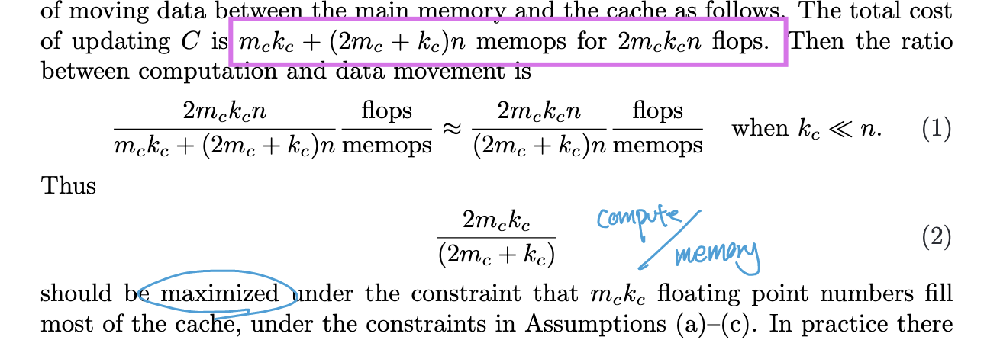
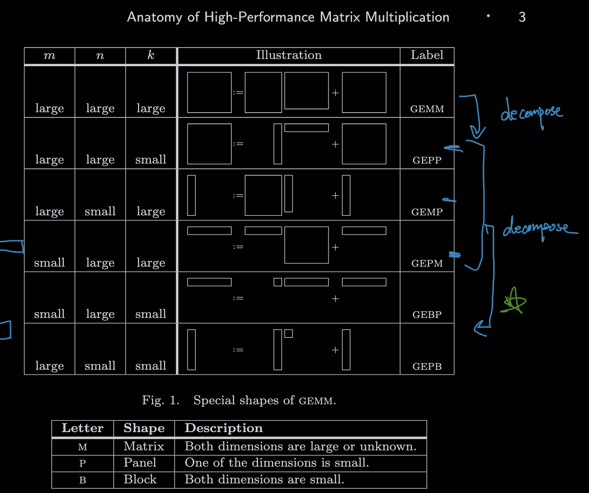
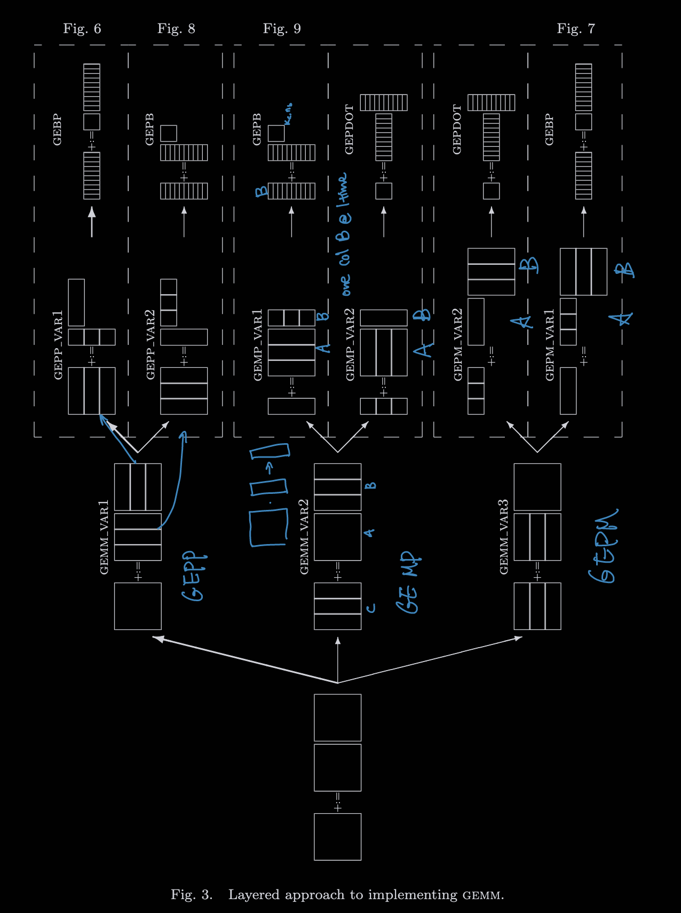

# Anatomy of High-Performance Matrix Multiplication

## 📋 Basic Information
- **Authors**: Kazushige Goto, Robert A. van de Geijn
- **Year**: 2008
- **Venue**: ACM Transactions on Mathematical Software (TOMS)
- **Link**: [PDF](https://www.cs.utexas.edu/~pingali/CS378/2008sp/papers/gotoPaper.pdf)

## 1. 📖 Paper Understanding

### The Problem

> What problem does this paper solve?
- **Fundamental computational bottleneck**: Matrix multiplication is one of the most important operations in scientific computing, but existing implementations were far from achieving peak performance on modern processors
- **Memory hierarchy complexity**: Modern processors have complex memory hierarchies (registers, L1/L2 cache, TLB, main memory) that are poorly utilized by naive matrix multiplication implementations

Layered Approach:
- choose inner kernel where A can fit into cache
- organize the outer loops so data movement (RAM <-> cache, cache <-> register) is mimized
- problem:
    1. assume inner A can fit within L1 cache
    2. ignore limitation (number of address can be stored) in TLB (translation lookaside buffer)


> Prior art and why they didn't work well:
- **Naive algorithms**: O(n³) algorithms with poor cache utilization led to memory-bound performance
- **Vendor libraries**: While optimized, many vendor BLAS implementations still left significant performance on the table
- **ATLAS**: Automated approach using empirical optimization, but lacked principled understanding of the underlying architectural constraints
- **Academic implementations**: Often focused on algorithmic improvements (e.g., Strassen's algorithm) rather than practical cache-conscious implementations

> Related work:
- Classical matrix multiplication algorithms (standard O(n³) approach)
- Cache-oblivious algorithms and recursive approaches
- ATLAS (Automatically Tuned Linear Algebra Software)
- Vendor BLAS libraries (Intel MKL, IBM ESSL)

### The Key Idea
> High-level approach to solving the problem:

Genearl GEMM can be decomposed into multiple calls to GEPP, GEMP, or GEPM, then these can be furthur decompose into GEBP, GEPB, or GEPDOT kernel. If small units are optimized then the whole matmul must be optimized.

- Pack submatrices into contiguous memory
    - reduece TLB pressure
    - exploit locaity
- Design kernel with L2 in mind

**Layered optimization approach** that systematically addresses data movement between different levels of the memory hierarchy:
- **Macro-level**: Organize computation to optimally amortize data movement between adjacent memory layers
- **Micro-level**: Design high-performance "inner-kernel" that efficiently computes small matrix subproblems
- **Memory-aware design**: Explicitly model and optimize for the memory hierarchy constraints

### The Challenge
> What are the main challenges in solving this problem?

- **Complex memory hierarchy**: Modern processors have multiple levels of cache with different characteristics (size, associativity, latency)
- **Data movement costs**: Memory bandwidth limitations mean that data movement often dominates computation time
- **TLB effects**: Translation Lookaside Buffer misses can significantly impact performance for large matrices
- **Architecture diversity**: Different processors require different optimization strategies
- **Balance between generality and performance**: Creating implementations that are both portable and high-performance

### The Method
> Brief overview (detailed analysis in Section 2):
- **Hierarchical blocking strategy**: Organize matrix multiplication into nested loops that respect cache hierarchies
- **Optimal inner-kernel design**: Identify and implement the most efficient kernel among six possible alternatives
- **Data packing techniques**: Pack matrices into contiguous memory regions for optimal cache utilization
- **TLB-aware optimizations**: Design access patterns that minimize TLB misses
- **Performance modeling**: Develop analytical models to guide optimization decisions

### Pros & Cons
> Strengths:
- **Near-peak performance**: Achieves performance very close to theoretical peak on multiple architectures
- **Principled approach**: Provides systematic methodology rather than ad-hoc optimizations
- **Broad impact**: Techniques applicable across different architectures and matrix sizes
- **Practical significance**: Directly led to GotoBLAS library with widespread adoption
- **Educational value**: Clear exposition of the relationship between algorithms and modern computer architecture

> Weaknesses/Limitations:
- **Architecture-specific tuning**: Still requires some architecture-specific optimization for peak performance
- **Implementation complexity**: The optimized code is significantly more complex than naive implementations
- **Focus on GEMM**: Primarily addresses general matrix multiplication, not the full spectrum of linear algebra operations

### Impact & Contributions
> Key contributions to the field:
- **Algorithmic contributions**:
  - Systematic approach to cache-conscious matrix multiplication
  - Identification of optimal inner-kernel design among multiple alternatives
  - Integration of TLB considerations into performance optimization

- **Systems contributions**:
  - Comprehensive analysis of memory hierarchy effects on matrix multiplication
  - Data packing strategies for improved cache utilization
  - Performance modeling framework for matrix multiplication

- **Practical impact**: 
  - GotoBLAS library became widely adopted in high-performance computing
  - Influenced design of subsequent BLAS libraries (OpenBLAS, BLIS framework)
  - Set new standards for matrix multiplication performance

#### **Paradigm Shift:**
- Changed focus from algorithmic complexity to memory hierarchy optimization
- Demonstrated the critical importance of understanding computer architecture for algorithm implementation
- Shifted BLAS library development from empirical optimization to principled design

#### **Long-term Influence:**
- **BLIS Framework**: Direct successor that generalized GOTO's insights
- **OpenBLAS**: Open-source implementation building on GOTO's techniques
- **Deep learning libraries**: Modern frameworks (BLAS-based operations in TensorFlow, PyTorch) benefit from these optimizations

> How did this paper change the field after its release?

- **Established new performance benchmarks**: Set expectations for what optimal matrix multiplication performance should look like
- **Influenced library development**: Major impact on development of subsequent high-performance linear algebra libraries
- **Research direction**: Shifted focus in HPC community toward memory hierarchy-aware algorithm design


### Useful Resources:
- Original paper: https://www.cs.utexas.edu/~pingali/CS378/2008sp/papers/gotoPaper.pdf
- TQ's lecture about hardware acceleration for Matmul: https://www.youtube.com/watch?v=es6s6T1bTtI

---

## 2. 🔬 Key Technical Details

### 1. **Memory Hierarchy Analysis**



this ratio is maximized when:
- A (m,k) fills most of the cache
- m ~= k -> square (Block)
so, this means:
- Make A as large as possible within cache limit
- balance m and k
    - eg: when m=k=n/100, even if memops is 10x slower than compute (flops), the time overhead is only 10%
- * glaorithm shift from memory bottleneck to compute bound
- hide memory cost under a lot of compute

#### Multi-level Memory Hierarchy
The paper identifies key levels in the memory hierarchy:

1. **Registers**: Fastest access, very limited capacity
2. **L1 Cache**: Small (~32KB), very fast, high bandwidth
3. **L2 Cache**: Larger (~256KB-1MB), slower than L1
4. **TLB (Translation Lookaside Buffer)**: Critical for large matrix performance
5. **Main Memory**: Large capacity, high latency

**Key Insight**: Optimize data movement between adjacent levels rather than just focusing on cache hit/miss ratios.

Q: where should A live?
L1 is very small. L2 is bigger.
- Key point: FLOPs are not vastly faster than L2→register transfers, so it’s okay if A streams from L2.
- * A in L2, B_j, C_j in L1

TLB:
- TLB miss is more expensive (stall CPU) than cache miss (can tolerate with prefetching)
- So; A, Bj, Cj, must all fit within TLB

Packing:
- In practice, A is a submatrix of a larger array → it’s strided in memory (not contiguous).
- pack A into a contiguous buffer ~A.

Data layout:
- A is packed in a way such that innermost kernel can walk through the memory strictly contgously

GEPB: in this case, A and B are swapped
GEPDOT: in this case, C is packed into L2

### 2. **The GOTO Algorithm Framework**






#### GEPP with GEBP
- GEPP is efficiently implemented by packing B once, then repeatedly calling GEBP with packed A blocks.
- Packing overhead is small (amortized over many flops).
- The scheme guarantees both cache efficiency (A in L2, B/C in L1) and TLB safety (contiguous packed blocks).

- Pro: packed B is reused
- pack A: cheaper, make access contiguous and cache/TLB friendly
- GEBP - always near peak performance

#### GEPM with GEBP
- Pack C into a temporary contiguous buffer `𝐶~`
- For each partition P: compute using GEBP opt2.
    - pack and transpose A~
- Finally unpack `𝐶~` back into C.
- Pro: C is contiguous
- Con: pack and unpack C is more expensive than packing A or B
- Sum: works but slower than GEPP -> GEBP

#### GEPM with GEBP
- pack and transpose A
- Pack B
- Unpack C
- Pro: reuse packed B
- Con; Row blocks of A -> may require a lot of TLB
- Sum: works but less good as GEPP -> GEBP


#### GEMP with GEPB
- Pro: Reuses packed B well (B panel is reused across many updates).
- Con: row block of A may require many TLB entries

#### GEMP and GEPM with GEPDOT
- now need to make C in L2
- every element of C must be loaded and stored repeatly
- takeaway: harder to optimize 


GEBP is inherently superior as the base kernel

#### Hierarchical Blocking Strategy

The algorithm organizes matrix multiplication `C := AB + C` using nested loops with carefully chosen block sizes:

```
for i := 0 to m-1 step mc do
  for j := 0 to n-1 step nc do
    for l := 0 to k-1 step kc do
      C[i:i+mc, j:j+nc] := A[i:i+mc, l:l+kc] * B[l:l+kc, j:j+nc] + C[i:i+mc, j:j+nc]
```

**Block Size Selection**:
- `mc × kc`: Size of A-block, chosen to fit in L2 cache with room for other data
- `kc × nc`: Size of B-block, chosen to fit in L1 cache  
- `mc × nr`: Size of C-block handled by inner kernel (register blocking)

#### Data Packing Strategy

**Problem**: Matrices stored in standard column-major or row-major format lead to:
- Non-contiguous memory access patterns
- Poor cache line utilization
- TLB thrashing for large matrices

**Solution**: Pack submatrices into contiguous "panels"
- **A-panel**: `mc × kc` block packed into contiguous memory
- **B-panel**: `kc × nc` block packed into contiguous memory
- **Benefits**: Improved cache utilization, reduced TLB misses, vectorization-friendly access patterns

### 3. How to Configure the Sizes
1.  Register Blocking
- GEBP: mr x nr
    - Each update perform: 2mnk -> high arithmetic intensity
- Registers hold a block of C while streaming A and B
- Keep C in register and spill back once done

2. mr and nr
- Q: how much register to dedicate for C
- Rule:
    - 1/2 register for C, other half to load A and B
    - best when mr ~= nr
    - Constraint: to hide latency of loading A from L2, we need: nr >= Rcomp / 2Rload
        - 2 comes from the fact that each multiply–add is counted as 2 flops.

3. choosing Kc
- larger K the better -> more reuse of B and C to amortize the memop furthur 
- BUT, constraint:
    - B_j must fit in L1 -> kn should take less than 1/ of L1 cache
    - A~ (mc, kc) must fit in L2 -> restricted by replacement policy and associativity
- Rule of thumb: choose K such that a column of B fills about half a page in memory

4. choosing Mc
- how tall (#row) of block A
- chosen such that mc x kc fills a large part of L2 but not more than what TLB can cover
- in pratice: half of the smaller of TLB coverage and L2 size


### 4. **Architecture-Specific Optimizations**

- these parameters differ a lot across CPUs (Pentium, Opteron, Itanium, Power, Alpha, etc.), but the design framework adapts to each.
- same Goto framework adapts systematically
    - The chosen algorithm (GEPP→GEBP opt1) achieves near-peak performance on many architectures
- All performance losses are due to packing overhead, not the kernel itself.
- Each architecture required different tuning parameters, but the design template was the same.
- When matrix shapes are very skinny (small m or n), alternatives may be preferable.

### Interesting Findings

#### **Critical Insights:**
- **Memory hierarchy dominates**: Performance is determined more by data movement than by computational complexity
- **Inner-kernel is crucial**: The choice of inner-kernel organization has dramatic impact on performance
- **Architecture matters**: Different architectures require different optimization strategies, but principles remain consistent
ant as cache misses for large matrices
- **Packing overhead**: The cost of data pa
#### **Surprising Results:**
- **Cache size**: Larger caches don't always lead to better performance if not used optimally  
- **TLB impact**: TLB misses can be as importcking is often more than offset by improved memory access patterns

#### **Design Principles:**
- **Hierarchy-aware**: Optimize for each level of the memory hierarchy independently
- **Balance**: Balance between memory bandwidth utilization and computational intensity
- **Architecture-specific**: General principles but architecture-specific implementations for peak performance

## 📚 References
- Goto, K., & van de Geijn, R. A. (2008). Anatomy of high-performance matrix multiplication. *ACM Transactions on Mathematical Software*, 34(3), 1-25.
- Dongarra, J. J., Du Croz, J., Hammarling, S., & Hanson, R. J. (1988). An extended set of FORTRAN basic linear algebra subprograms. *ACM Transactions on Mathematical Software*, 14(1), 1-17.
- Whaley, R. C., Petitet, A., & Dongarra, J. J. (2001). Automated empirical optimizations of software and the ATLAS project. *Parallel Computing*, 27(1-2), 3-35.

## Background Concepts: Matrix Multiplication and Memory Hierarchy

### Historical Context

1. **Classical Algorithms (1960s-1980s)**:
   - Standard O(n³) algorithm: three nested loops
   - Strassen's algorithm (1969): O(n^2.807) complexity but high constant factors
   - Focus on reducing arithmetic operations rather than memory efficiency

2. **Cache-Conscious Computing (1990s)**:
   - Recognition of "memory wall" problem
   - Cache-oblivious algorithms (Frigo, Leiserson, Prokop, Ramachandran)
   - Recursive divide-and-conquer approaches

3. **ATLAS Revolution (Late 1990s)**:
   - Automated empirical optimization
   - Architecture-adaptive code generation
   - Proof that significant performance gains were possible

### Matrix Multiplication Fundamentals

#### Basic Algorithm
```c
for (i = 0; i < m; i++)
  for (j = 0; j < n; j++)   // reduction dimension
      C[i][j] = 0
    for (l = 0; l < k; l++)
      C[i][j] += A[i][l] * B[l][j];
```

**Problems with naive approach**:
- Poor spatial locality in B array access
- No temporal locality exploitation
- Cache-unfriendly for large matrices
 
#### Blocked Matrix Multiplication
```c
for (i = 0; i < m; i += block_size)
  for (j = 0; j < n; j += block_size)
    for (l = 0; l < k; l += block_size)
      // Multiply blocks
      multiply_blocks(A[i:i+bs][l:l+bs], B[l:l+bs][j:j+bs], C[i:i+bs][j:j+bs])
```

**Benefits of blocking**:
- Improved cache reuse
- Better memory bandwidth utilization
- Reduced memory traffic


#### Data Layout
- Row Major
- Column Major
- Stride Format: 
    - A[i,j] -> Adata[i * Astrides[0] + j * A.strides[1]]
    - what increament to use in what dimension
    - enable both row or col major implementation
    - allow slice / transpose / broadcast with zero copy
    - con: memory access becomes not continous


### Memory Hierarchy Fundamentals

#### Modern Processor Memory System
1. **Registers**: 
   - ~32-128 registers
   - 1 cycle access time
   - Explicitly managed by compiler/programmer

2. **L1 Cache**:
   - 32-64KB typical size
   - 1-3 cycle access time  
   - around 0.5ns
   - High associativity (8-16 way)

3. **L2 Cache**:
   - 256KB-2MB typical size
   - 10-20 cycle access time
   - around 7ns
   - Medium associativity (4-8 way)

4. L3 Cache (on some architectures):
   - 2-20MB typical size
   - 20-40 cycle access time
   - Lower associativity

5. **Main Memory**:
   - GBs capacity
   - 100-300 cycle access time
   - High bandwidth but high latency
   - ~200ns

#### Key Principles
- **Temporal locality**: Recently accessed data likely to be accessed again
- **Spatial locality**: Data near recently accessed data likely to be accessed
- **Cache line effects**: Data transferred in fixed-size chunks (typically 64 bytes)

### BLAS Evolution

#### BLAS Levels
1. **BLAS-1**: Vector operations (SAXPY: y := αx + y)
2. **BLAS-2**: Matrix-vector operations (GEMV: y := αAx + βy)  
3. **BLAS-3**: Matrix-matrix operations (GEMM: C := αAB + βC)

#### Why BLAS-3 is Important
- **High computational intensity**: O(n³) operations on O(n²) data
- **Better cache reuse**: More computation per byte loaded
- **Theoretical performance ceiling**: Can achieve high fraction of peak performance

The GOTO paper specifically focuses on GEMM (General Matrix Multiply) as the most important BLAS-3 operation, since many other operations can be expressed in terms of GEMM or benefit from similar optimization techniques.
