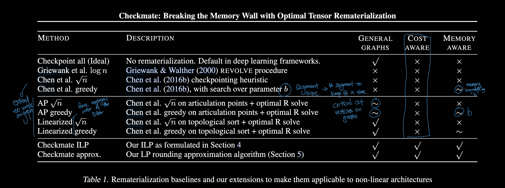

# Checkmate: Breaking the Memory Wall with Optimal Tensor Rematerialization

## 📋 Basic Information
- **Authors**: Paras Jain, Ajay Jain, Aniruddha Nrusimha, Amir Gholami, Pieter Abbeel, Kurt Keutzer, Ion Stoica, Joseph E. Gonzalez
- **Year**: 2020
- **Venue**: MLSys
- **Link**: [PDF](https://arxiv.org/abs/1910.02653)

## 1. 📖 Paper Understanding

deep learning system + optimization paper.

### The Problem

> What problem does this paper solve?

- **Memory Wall**: Deep neural network training is limited by GPU memory, not computation
    - *Activations* take up A LOT OF memory
    - Training modern DNN is memory intensive, espcially with larger batch sizes, long sequences (transformers), or deep architectures.
    - GPUs are extremely powerful at compute, but their device memory HBM is limited (16-80GB), and training can require hundreds of GBs.
- **Scale Limitation**: Larger models and batch sizes are constrained by memory capacity
- **Trade-off Challenge**: Existing solutions force a choice between memory efficiency and training speed
- **Suboptimal Checkpointing**: Prior checkpointing strategies are ad-hoc and suboptimal


** Can we systematically find the optimal rematerialization policy for a given model and device?

** How to trade-off between training time and memory requirements?


> Prior art and why they didn't work well:

- **Rematerialization**: 
    - don't save any intermediate activations, just recompute them during backprop
    - saves memory but costs alot more compute

- Activation COmpression: reduce memory by constant factor but also reduce accuracy.

- **Gradient Checkpointing (Chen et al.)**: Save only subset of activations (every √(n)-th layer), recompute others
  - reduce memory from O(n) to O(√(n))
  - recomputation at O(n) cost
  - But: heuristic choices of what to checkpoint 
        - DNN layers vary significantly in memory usage and computational cost in practice
  - No principled optimization of the memory-time trade-off
  - Often leads to significant computational overhead

Recomputation:
$$
\underbrace{\sqrt{n}}_{\text{\#segments}} \times \underbrace{\sqrt{n}}_{\text{segment length}} = O(n)
$$

- **Heuristic methods in frameworks:**
    - PyTorch, TensorFlow, JAX have “activation checkpointing” utilities, usually hand-designed rules (e.g., checkpoint every block).
    - Tensorflow: each activation is freed after its graident has been calculated


These methods are not optimal — they balance memory vs. compute with ad hoc strategies.

- **Memory-efficient optimizers**: Techniques like gradient accumulation
  - But: limited scalability and still hit fundamental memory limits

- **Model parallelism**: Split model across multiple devices
  - But: adds communication overhead and complexity
  - Doesn't solve single-device memory constraints





### The Key Idea

> High-level approach to solving the problem:

Analogy: Instead of checkpointing heuristics, use exact combinatorial optimization.

Formalize the **tensor rematerialization problem** as an *optimization problem* and solve it optimally:
- **Mathematical formulation**: Model memory-time trade-offs as a mixed-integer linear program (MILP)
- **Optimal scheduling**: Find the best decision of which tensors to store vs. recompute
- **System integration**: Implement optimal schedules in practical training loops
- **Hardware awareness**: Account for actual hardware costs in optimization

At the core, Checkmate solves the tensor rematerialization *scheduling* problem:
- Inputs:
    - Computation graph of the model (operators, dependencies, tensor sizes).
    - Memory capacity of the device.
- Goal:
    - Fit training within memory capacity
    - minimize recomputation overhead

### The Challenge

> What are the main challenges in solving this problem?

- **Complexity**: Exponential search space for rematerialization decisions
- **Hardware heterogeneity**: Different accelerators have different memory/compute trade-offs
- **Dynamic nature**: Memory and compute costs depend on actual tensor shapes and operations
- **Integration**: Making optimal schedules work with existing training frameworks
- **Scale**: Solving optimization for realistic networks with millions of operations

### The Method

> Brief overview (detailed analysis in Section 2):

1. **Problem Formulation**: Express rematerialization as MILP optimization
2. **Cost Modeling**: Profile hardware-specific costs for different operations
3. **Solver Integration**: Use off-the-shelf MILP solvers or approximation algorithms
4. **Schedule Execution**: Implement optimal schedules in training frameworks
5. **Dynamic Application**: Apply computed schedules across millions of training iterations

Step 1: Model as a DAG
- Represent forward and backward pass as a directed acyclic graph (DAG).
- Nodes = operators.
- Edges = tensor dependencies.
- Each tensor has a memory cost.

Step 2: Formulate the Optimization Problem (MILP)
- Decision Variables:
    - which tensor to keep in memory vs. recompute
    - scheduling of forward/backward ops
- Constraints:
    - Memory usage at any time <= device limit
    - dependency order is respected
- Objective:
    - minimize total computation time (original + recomputetation)

Step 3: Solving with MILP
- use standard MILP solver
- exploit chain-like dependencies structure in DNN computation graph
- can handle large models like ResNet, BERT, even GPT2

Step 4: Execution
- once the optimal schedule is found, checkmate generates a custom training loop to execute according to that schedule
- integrates with PyTorch with graph tracing

#### **Key Components:**
- **Computational graph analysis**: Model DNN forward/backward pass as DAG
- **Memory-time modeling**: Capture trade-offs between storage and recomputation
- **Constraint satisfaction**: Ensure memory limits while minimizing training time
- **Profile-guided optimization**: Use real hardware measurements for accurate costs

#### **Principled Optimization**:
- **General graphs**: Handle arbitrary computational graphs (not just chains)
- **Realistic costs**: Use profiled hardware-specific costs
- **Global optimization**: Consider entire computation holistically

#### **MILP Formulation Advantages**:
- **Optimality**: Find provably best solutions when possible
- **Flexibility**: Easy to add constraints (memory, time, etc.)
- **Generality**: Handle any DAG structure, not just chains

#### **Systems Integration**:
- **Framework integration**: Work with existing training code
- **Runtime adaptation**: Handle dynamic tensor shapes and costs
- **Error handling**: Graceful degradation when predictions are wrong

### Pros & Cons

> Strengths:
- **Optimality**: First principled approach to optimal tensor rematerialization
- **Significant gains**: Enables 5.1x larger input sizes on real networks
- **Hardware-aware**: Accounts for actual accelerator characteristics
- **Practical impact**: Works with existing frameworks and realistic networks
- **Broad applicability**: Benefits various architectures (ResNet, Transformer, etc.)
- **Open source**: Available for community use and further research

> Weaknesses/Limitations:
- **Solve time**: MILP solving can take up to an hour for complex networks
- **Static schedules**: Computed schedules are fixed, not adaptive to runtime conditions
- **Framework dependence**: Requires integration with specific training frameworks
- **Memory model assumptions**: Simplified memory model may not capture all overhead

### Impact & Contributions

> Key results

1. 5.1x bigger input size

> Key contributions to the field:

#### **Algorithmic Innovations**:
- **Formalization**: First formal treatment of tensor rematerialization as optimization problem
- **MILP modeling**: Novel mixed-integer linear programming formulation
- **Approximation algorithms**: Fast heuristics when exact solving is too slow
- **Cost modeling**: Hardware-aware profiling for accurate trade-off modeling

Gurantee optimality. Saves order of magnitude of memory for some model and enable training that was previously infeasible.

#### **Systems Contributions**:
- **Framework integration**: Seamless integration with PyTorch and other frameworks
- **Schedule execution**: Efficient runtime system for executing optimal schedules
- **Memory tracking**: Precise memory usage tracking during training
- **Profiling tools**: Automated cost profiling for different hardware

#### **Practical Impact**:
- **Memory scaling**: Enables training much larger models on existing hardware
- **Cost reduction**: Significant training cost savings in cloud environments
- **Accessibility**: Makes large-scale training more accessible with limited resources

#### **Research Influence**:
- **Systems ML**: Demonstrated importance of principled optimization in ML systems
- **Memory optimization**: Inspired follow-up work on memory-efficient training
- **Compiler integration**: Influenced development of ML compilers with memory optimization

> How did this paper change the field after its release?

- **Paradigm shift**: From ad-hoc memory management to principled optimization
- **Tool adoption**: Checkmate became standard tool for memory-constrained training
- **Research direction**: Sparked research into automated ML system optimization
- **Industry impact**: Adopted by companies for large-scale model training
- **Framework integration**: Influenced memory optimization features in major ML frameworks

> Hihger level impact
1. Bridging ML and Systems Optimization:
    - Shows how classical optimization (MILP) can solve a very practical ML systems problem.
2. Impact on Large Model Training:
    - Memory-efficient training methods are foundational for scaling up models (e.g., transformers with billions of parameters).
    - Checkmate directly influenced later work on compiler-level graph optimization (e.g., Alpa, DeepSpeed’s memory optimizations, PyTorch’s activation checkpointing improvements).

### Background

- **Useful background knowledge:**
  - Mixed-integer linear programming (MILP)
  - Deep learning training dynamics and computational graphs
  - GPU memory hierarchy and management
  - Automatic differentiation and backpropagation
  - Distributed and parallel training systems

#### **Pre-history and context:**
- **Memory constraints**: GPU memory has always been a limiting factor in deep learning
- **Checkpointing origins**: Technique borrowed from scientific computing for memory efficiency
- **Ad-hoc solutions**: Prior work relied on heuristics and manual tuning
- **Scaling challenges**: Growing model sizes made memory management critical
- **Systems-ML emergence**: Growing recognition that systems optimizations are crucial for ML

### Useful Resources:
- Original Checkmate paper: https://arxiv.org/abs/1910.02653
- Checkmate GitHub: https://github.com/parasj/checkmate
- MLSys conference papers on memory optimization
- "Gradient Checkpointing" techniques and related work
- Mixed-Integer Linear Programming tutorials and solvers


## 2. 🔬 Key Technical Details

### 1. **Problem Formulation**

#### **Tensor Rematerialization as Optimization**

The core insight is to formalize the memory-time trade-off as a mathematical optimization problem:

**Given**: 
- Computational graph G = (V, E) representing DNN forward/backward pass
- Memory budget M (GPU memory limit)
- Operation costs: compute time C(v) and memory usage S(v) for each node v

**Goal**: 
- Minimize total training time while staying within memory budget
- Decide for each tensor: store in memory vs. recompute when needed

**Decision Variables**:
- Binary variables indicating whether to store each intermediate tensor
- Schedule variables determining when to recompute each tensor

#### **MILP Formulation**

**Objective Function**:
```
minimize: Σ(recomputation_cost × recompute_decision)
```

**Constraints**:
```
Memory constraint: Σ(tensor_size × store_decision) ≤ Memory_Budget
Dependency constraints: Ensure tensors available when needed
Recomputation constraints: Can only recompute if inputs available
```

**Key Variables**:
- `s_v ∈ {0,1}`: whether to store tensor v
- `r_v,t ∈ {0,1}`: whether to recompute tensor v at time t
- `m_t`: memory usage at time t

### 2. **Cost Modeling**

#### **Hardware-Aware Profiling**

Accurate cost modeling is crucial for optimal decisions:

**Memory Costs**:
- Tensor storage: `S(v) = tensor_size(v) × element_size`
- Peak memory tracking across entire computation
- Account for temporary allocations during operations

**Compute Costs**:
- Operation timing: `C(v) = profile_time(operation_v)`
- Hardware-specific measurements (GPU model, memory bandwidth)
- Include data movement costs between memory levels

**Profile-Guided Optimization**:
1. **Static profiling**: Measure operation costs offline
2. **Shape inference**: Compute tensor sizes for given input shapes
3. **Cost interpolation**: Estimate costs for unseen tensor sizes
4. **Hardware adaptation**: Different profiles for different accelerators

### 3. **Solving Strategies**

#### **Exact MILP Solving**

Use commercial or open-source MILP solvers:
- **Gurobi**: High-performance commercial solver
- **CPLEX**: IBM's commercial optimization suite  
- **SCIP**: Open-source solver for large problems

**Solving Process**:
1. Convert computational graph to MILP formulation
2. Add all constraints and objective function
3. Invoke solver with time limits and optimality gaps
4. Extract optimal rematerialization schedule

**Challenges**:
- NP-hard problem: exponential worst-case complexity
- Large networks create huge MILP instances
- Solving time can be prohibitive (hours for large networks)

#### **Approximation Algorithms**

For cases where exact solving is too slow:

**Greedy Heuristics**:
- **Benefit-cost ratio**: Prioritize tensors with highest reuse/memory ratio
- **Critical path**: Focus on tensors on longest computational paths
- **Memory pressure**: Adapt decisions based on current memory usage

**Dynamic Programming**:
- Optimal substructure for certain graph topologies
- Linear time for chains and trees
- Exponential for general DAGs but practical for many networks

**Evolutionary Approaches**:
- Genetic algorithms for schedule optimization
- Simulated annealing for local search improvements
- Population-based methods for diverse solution exploration

### 4. **System Implementation**

#### **Framework Integration**

**PyTorch Integration**:
- Hook into autograd system for automatic scheduling
- Custom memory allocator for precise tracking
- Backward hook registration for recomputation triggers

```python
# Simplified integration example
class CheckmateHook:
    def __init__(self, schedule):
        self.schedule = schedule
    
    def __call__(self, grad):
        # Apply rematerialization schedule
        return self.recompute_if_needed(grad)
```

**Execution Engine**:
- **Schedule interpretation**: Convert MILP solution to executable actions
- **Memory management**: Track allocation/deallocation precisely  
- **Recomputation triggers**: Invoke forward computation when tensors needed
- **Error handling**: Fallback strategies when memory estimates are wrong

#### **Memory Tracking**

**Precise Accounting**:
- Track every tensor allocation and deallocation
- Account for temporary tensors during operations
- Handle memory fragmentation effects

**Dynamic Adaptation**:
- Monitor actual vs. predicted memory usage
- Adjust schedule if predictions are inaccurate
- Emergency fallback to gradient checkpointing

### 5. **Advanced Techniques**

#### **Multi-GPU Optimization**

**Distributed Memory**: 
- Model memory across multiple devices
- Optimize tensor placement and movement
- Account for communication costs

**Pipeline Integration**:
- Coordinate with pipeline parallelism
- Optimize across pipeline stages
- Handle bubble time and memory trade-offs

#### **Dynamic Batching**

**Adaptive Batch Sizes**:
- Increase batch size when memory permits
- Maintain training stability with larger batches
- Optimize for throughput vs. memory trade-offs

### Interesting Findings

#### **Empirical Results**:

**Memory Scaling**:
- **5.1x larger inputs**: Demonstrated on ResNet, Transformer models
- **2-3x memory reduction**: Typical savings with <10% time overhead
- **Break-even analysis**: When recomputation pays off vs. smaller batches

**Hardware Insights**:
- **V100 vs A100**: Different optimal strategies due to compute/memory ratios  
- **Memory bandwidth**: Critical factor in recomputation decisions
- **Tensor Core utilization**: Affects recomputation cost estimates

#### **Architectural Patterns**:

**ResNet**: 
- Skip connections create reuse opportunities
- Optimal to recompute early layers, store later activations

**Transformers**:
- Attention matrices are expensive to store but cheap to recompute
- Layer normalization creates good checkpointing points

**CNNs**:
- Convolutional layers have predictable memory patterns
- Pooling layers are natural checkpoint boundaries

#### **Scaling Analysis**:

**Problem Size**:
- Networks with 100+ layers: solve in <1 hour
- Very large Transformers: need approximation algorithms  
- Memory-bound problems: biggest benefits from optimization

**Solver Performance**:
- Modern MILP solvers handle most practical networks
- Approximation algorithms within 5-10% of optimal
- Solving time grows roughly linearly with network depth

## 📚 References
- Jain, P., Jain, A., Nrusimha, A., Gholami, A., Abbeel, P., Keutzer, K., ... & Gonzalez, J. E. (2020). Checkmate: Breaking the memory wall with optimal tensor rematerialization. Proceedings of Machine Learning and Systems, 2, 497-511.
- Chen, T., Xu, B., Zhang, C., & Guestrin, C. (2016). Training deep nets with sublinear memory cost. arXiv preprint arXiv:1604.06174.
- Gurobi Optimization, LLC. (2023). Gurobi Optimizer Reference Manual.

## Background Concepts: Mixed-Integer Linear Programming (MILP)

### Historical Context

1. **Linear Programming Origins (1940s)**:
   - Developed during WWII for military logistics optimization
   - Simplex method by George Dantzig (1947)
   - Foundation for operations research and optimization

2. **Integer Programming Extension (1950s-1960s)**:
   - Ralph Gomory introduced cutting plane methods
   - Branch-and-bound algorithms for discrete optimization
   - Recognition that many practical problems require discrete decisions

3. **Mixed-Integer Programming (1970s-1980s)**:
   - Combination of continuous and discrete variables
   - More flexible modeling of real-world problems
   - Advanced solver development with commercial tools

### MILP Fundamentals

#### **Problem Structure**:
```
minimize:    c^T x + d^T y
subject to:  Ax + By ≤ b
             x ≥ 0 (continuous variables)  
             y ∈ {0,1}^n (binary variables)
```

**Components**:
- **Objective function**: Linear combination of variables to optimize
- **Constraints**: Linear inequalities/equalities that must be satisfied  
- **Variable types**: Mix of continuous and integer/binary variables
- **Feasible region**: Set of variable assignments satisfying all constraints

#### **Solving Methods**:

**Branch and Bound**:
1. Solve relaxed problem (ignore integer constraints)
2. If solution has fractional integers, branch into subproblems
3. Bound: use relaxed solution as bound for subproblems  
4. Prune: eliminate subproblems that can't improve best solution

**Cutting Planes**:
- Add linear inequalities that eliminate fractional solutions
- Tighten relaxation without removing integer feasible points
- Often combined with branch-and-bound in modern solvers

**Heuristics**:
- Rounding: round fractional solutions to nearest integers
- Local search: improve integer solutions by neighborhood exploration
- Constructive: build solutions incrementally with greedy choices

### Applications in ML Systems

#### **Resource Allocation**:
- **Model placement**: Decide which device to place each layer
- **Memory management**: Choose what to cache vs. recompute  
- **Scheduling**: Optimize execution order of operations

#### **Model Optimization**:
- **Neural architecture search**: Select optimal network structures
- **Pruning**: Decide which weights/neurons to remove
- **Quantization**: Choose precision levels for different parameters

#### **Training Optimization**:
- **Batch scheduling**: Optimize training data order and batching
- **Checkpointing**: Select optimal points for gradient checkpointing
- **Pipeline optimization**: Optimize pipeline parallelism schedules

### Why MILP for Checkmate?

#### **Natural Fit**:
- **Binary decisions**: Store tensor (1) or recompute (0)
- **Resource constraints**: Memory budget as linear constraint
- **Optimization goal**: Minimize training time (linear objective)
- **Dependencies**: Tensor dependencies as linear constraints

#### **Advantages**:
- **Optimality guarantees**: MILP solvers find provably optimal solutions
- **Mature tooling**: Commercial solvers are highly optimized
- **Flexibility**: Easy to add new constraints and objectives
- **Scalability**: Modern solvers handle problems with millions of variables

#### **Challenges**:
- **Complexity**: NP-hard problems can have exponential solve times
- **Modeling accuracy**: Linear approximations may miss important effects  
- **Dynamic behavior**: Static solutions may not adapt to runtime changes
- **Solver dependence**: Requires access to commercial or complex open-source solvers

### Advanced MILP Techniques

#### **Problem Decomposition**:
- **Benders decomposition**: Separate master and subproblems
- **Lagrangian relaxation**: Relax constraints with penalty terms
- **Column generation**: Generate variables dynamically during solving

#### **Formulation Improvements**:
- **Big-M constraints**: Model logical implications with large constants
- **SOS (Special Ordered Sets)**: Handle piecewise linear functions
- **Symmetry breaking**: Add constraints to eliminate equivalent solutions

#### **Warm Starting**:
- **Solution reuse**: Start with solutions from similar problems
- **Basis information**: Reuse simplex basis from related problems  
- **Heuristic initialization**: Use fast heuristics to find starting solutions

## Background Concepts: Gradient Checkpointing

### Memory Challenges in Deep Learning

#### **Forward-Backward Memory Pattern**:

**Forward Pass**: 
- Compute activations layer by layer: `a₁ = f₁(x), a₂ = f₂(a₁), ..., aₙ = fₙ(aₙ₋₁)`
- Store all intermediate activations for use in backward pass
- Memory grows linearly with network depth: O(n) storage

**Backward Pass**:
- Compute gradients using chain rule: needs activations from forward pass
- Without stored activations, would need to recompute entire forward pass
- Memory usage peaks during forward pass, then decreases during backward

#### **The Memory Wall**:
- **Model growth**: Networks getting deeper and wider over time
- **Batch size**: Larger batches improve training but multiply memory needs  
- **Hardware limits**: GPU memory has not grown as fast as model sizes
- **Cost implications**: Smaller batches mean less efficient training

### Gradient Checkpointing Approaches

#### **Basic Checkpointing (Chen et al., 2016)**:

**Strategy**: Save every k-th activation, recompute others during backward pass

```python
# Simplified checkpointing
def forward_with_checkpointing(x, layers, k=2):
    saved_activations = {}
    activation = x
    
    for i, layer in enumerate(layers):
        activation = layer(activation)
        if i % k == 0:  # Checkpoint every k layers
            saved_activations[i] = activation.detach()
    
    return activation, saved_activations
```

**Trade-off**:
- Memory: O(n/k) instead of O(n)
- Compute: O(k) extra forward passes during backward
- Simple but suboptimal checkpoint placement

#### **Revolve/Treeverse Algorithm**:

**Optimal for Chain Computations**:
- Dynamic programming solution for optimal checkpointing
- Minimizes recomputation given memory budget
- Recursive structure: solve subproblems optimally

**Algorithm Intuition**:
1. **Base case**: Small chains can be stored entirely
2. **Recursive case**: Place one checkpoint optimally, solve subproblems
3. **Revolving**: Reuse checkpoint memory as computation progresses

**Optimality**: Provably minimal recomputation for given memory budget

#### **Sublinear Memory Training**:

**Memory Reduction**: O(√n) memory for n-layer networks
- **Square-root checkpointing**: Checkpoint every √n layers
- **Nested checkpointing**: Hierarchical checkpoint structure  
- **Adaptive strategies**: Adjust checkpointing based on layer costs

### Limitations of Prior Work

#### **Heuristic Nature**:
- **Fixed intervals**: Checkpoint every k layers regardless of costs
- **Uniform treatment**: All layers treated equally despite different memory/compute costs
- **Graph structure**: Don't account for complex architectures (ResNets, Transformers)

#### **Lack of Hardware Awareness**:
- **Abstract models**: Don't consider actual hardware characteristics
- **Cost assumptions**: Assume uniform recomputation costs
- **Memory models**: Simplified memory usage patterns

#### **Limited Scope**:
- **Chain graphs**: Most work focused on feed-forward chains
- **Single device**: Don't optimize across multiple GPUs/devices
- **Static schedules**: Don't adapt to runtime conditions

## Background Concepts: Memory Hierarchy and GPU Architecture

### GPU Memory Systems

GPU memory is hierarchical: Registers → Shared/L1 → L2 → HBM → Host DRAM.

#### **Memory Hierarchy**:
1. **Registers**: Fastest, private to each thread, ~KB per SM
    - Each CUDA core / thread has its own private registers.
    - Stores scalars or very small tensors.
    - Latency: ~1 cycle
2. **Shared memory** (L1): Fast, shared within thread block, ~100KB per SM  
    - Shared among threads in a block (SM = Streaming Multiprocessor).
    - Latency: ~10s of cycles.
    - Used for inter-thread communication and temporary storage.
3. **L2 cache**: ~MB range, shared across SMs, ~100 cycles.
4. **Global memory (HBM, off-chip)**: Largest, ~GB range, highest latency
    - This is what we normally call “GPU memory” (e.g., 16 GB, 40 GB, 80 GB).
    - Very high bandwidth (hundreds of GB/s to >1 TB/s), but latency is much higher than on-chip memory.
    - Store:
        - Model weights
        - activations
        - gradients
        - optimizer states (adam + variance)
5. Host Memory (CPU DRAM): 
    - accessible over PCIe or NVLink
    - Much slower (microsecond latency)
    - sometime used for offloading tensor when GPU memory is insufficient (significantly slow down training)


#### **Implications for ML**:
- **Large tensors**: Live in global memory, bandwidth-bound operations
- **Small tensors**: May fit in cache, compute-bound operations  
- **Access patterns**: Sequential access much faster than random
- **Occupancy**: Higher occupancy can hide memory latency

#### Memory usage during training
1. Model parameters (weights)
    - forward: need to compute activation
    - backprop: need to compute gradient
    - store persistently
2. Intermediate activations
    - each layer's output is needed for backprop
    - if kept, then memory becomes O(depth x batch) 
    - biggest contributor to memory wall
3. Gradients
    - one graident tensor per weight arameters
    - size = size of model weights
4. optimizer states
    - eg: Adam has 2 - (momentum + variance)
    - size = 2 x model weights 

Example:

1B-parameter transformer: parameters = ~4 GB (fp16), optimizer states = ~8 GB, activations = ~40–60 GB (for a reasonable batch).

### Memory Management in ML Frameworks

#### **PyTorch Memory Model**:
```python
# Memory allocation patterns
x = torch.randn(1024, 1024)  # Allocate in global memory
y = F.relu(x)                # May reuse memory if x not needed
z = x + y                    # Requires both x and y in memory
```

**Caching Allocator**:
- **Memory pools**: Pre-allocate large chunks, suballocate from pool
- **Fragmentation**: Internal fragmentation from varying tensor sizes
- **Garbage collection**: Reference counting for automatic cleanup

#### **Memory Pressure Handling**:
- **Out of memory errors**: Hard failure when allocation fails
- **Gradient accumulation**: Trade batch size for memory usage
- **Mixed precision**: Use FP16 to halve memory usage
- **Model parallelism**: Split model across devices

### Tensor Lifecycle in Training

#### **Forward Pass Memory**:
```
Input → Conv1 → Activation1 → Conv2 → Activation2 → ... → Loss
  ↑       ↑         ↑         ↑         ↑              ↑
  |       |         |         |         |              |
  Needs to be kept for backward pass (unless checkpointed)
```

#### **Backward Pass Memory**:
- **Gradient computation**: Needs forward activations
- **Parameter updates**: Accumulate gradients for optimizer
- **Memory release**: Can free activations after gradients computed

#### **Peak Memory Usage**:
- **Typically during forward**: All activations plus parameters
- **Memory profile**: Sawtooth pattern as tensors allocated/freed
- **Optimization opportunity**: Careful scheduling can reduce peak

### Memory Optimization Strategies

#### **Operator Fusion**:
- **Kernel fusion**: Combine multiple operations in single kernel
- **Reduced memory traffic**: Intermediate results stay in cache/registers
- **Examples**: BatchNorm+ReLU, Conv+BiasAdd+ReLU

#### **Memory Reuse**:
- **In-place operations**: Overwrite input with output when safe
- **Tensor sharing**: Multiple views of same underlying memory
- **Workspace reuse**: Reuse temporary memory across operations

#### **Algorithmic Optimizations**:
- **Flash Attention**: Optimize attention computation for memory hierarchy
- **Gradient checkpointing**: Trade compute for memory (Checkmate's domain)
- **Reversible layers**: Compute inverse instead of storing activations

### Hardware Trends and Implications

#### **Memory Wall**:
- **Compute growth**: FLOPS grow faster than memory bandwidth
- **Capacity limits**: Memory capacity grows slower than model sizes
- **Cost considerations**: Memory is often the expensive component

#### **Future Directions**:
- **High bandwidth memory**: HBM2e, HBM3 for higher bandwidth
- **Near-data processing**: Processing-in-memory technologies
- **Hierarchical approaches**: Multi-tier storage systems

#### **Software Implications**:
- **Memory-first design**: Optimize for memory usage first, then compute
- **Adaptive algorithms**: Adjust to available memory dynamically
- **Cross-layer optimization**: Coordinate across application, framework, hardware