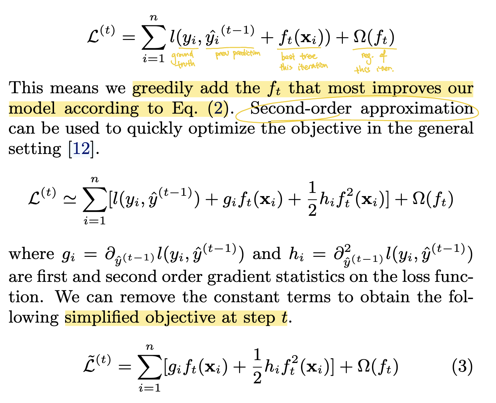
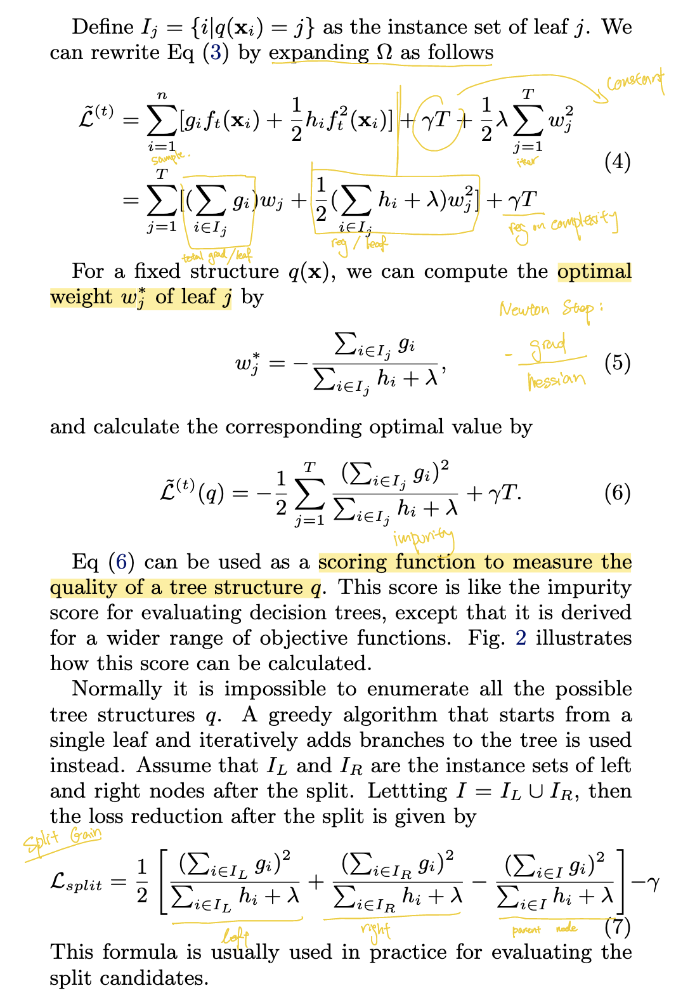
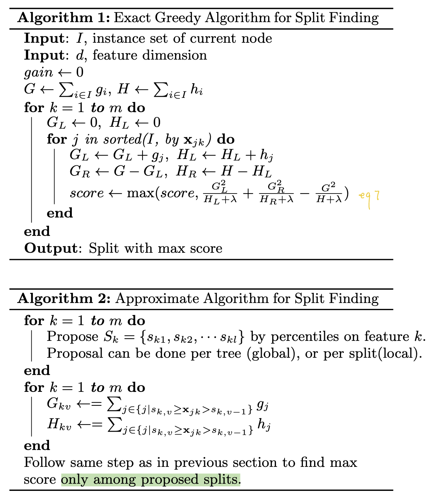
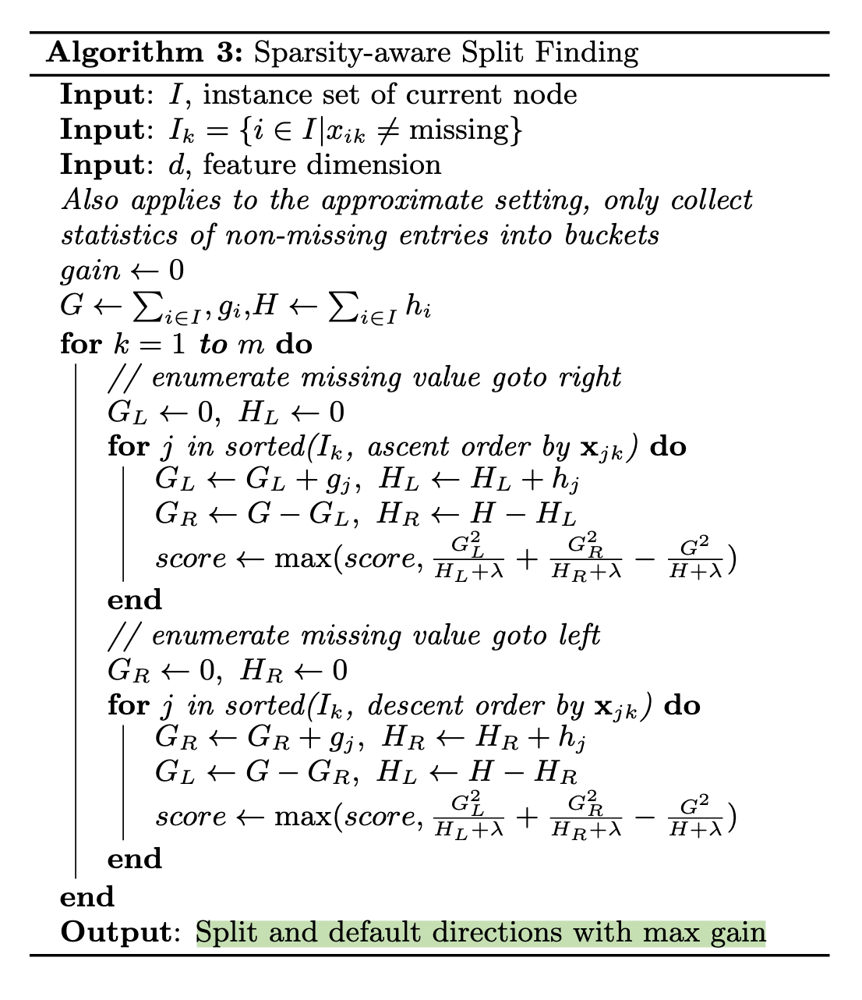
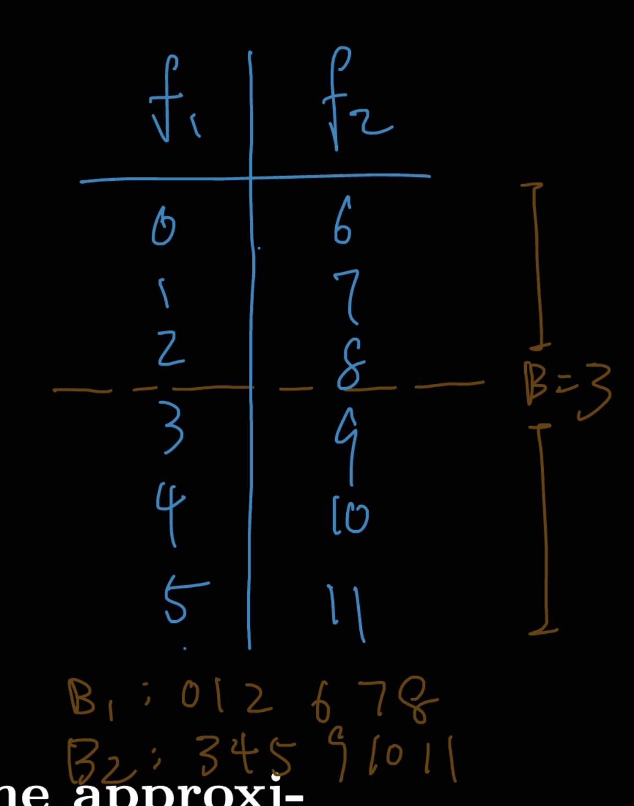

# XGBoost: A Scalable Tree Boosting System

## 📋 Basic Information
- **Authors**: Tianqi Chen, Carlos Guestrin
- **Year**: 2016
- **Venue**: KDD
- **Link**: [PDF](https://arxiv.org/pdf/1603.02754)

## 1. 📖 Paper Understanding

### The Problem

> What problem does this paper solve?
- Tree boosting: it is known to give **SOTA accuracy** in many tasks (classification, ranking, regression)
- But **scalability** was a big problem: existing GBM are slow, memory intensive, and not robust for sparse & large data

> Prior art and why they didn't work well:

A key problem in tree boosting is to find the best split. Piror arts includes:
- scikit learn, R's gbm: basic exact greedy algorithm on **single machine** -> SLOW!!
    - computationally demanding to enumerate through all possible splits for continous features
    - first sort the data according to feature values then visit the data in sorted order

- Existing systems couldn't handle sparse data efficiently
- Memory limitations prevented processing large datasets
- No effective out-of-core computation support
- Limited parallelization and distributed computing capabilities

### The Key Idea
> High-level approach to solving the problem:

XGBoost is still gradient tree boosting, but it introduces regularization + system-level innovations.


### The Challenge
> What are the main challenges in solving this problem?

- **Scalability**: Handle billions of examples with limited resources
- **Sparse data**: Real-world data often has missing values and sparse features
- **Memory efficiency**: Process datasets larger than available RAM
- **Speed**: Existing implementations too slow for practical use
- **Approximate tree learning**: Balance between accuracy and efficiency


### The Method
> Brief overview (detailed analysis in Section 2):
- Gradient tree boosting with second-order approximation
- Sparsity-aware split finding algorithm
- Weighted quantile sketch for approximate tree learning
- Cache-aware block structure for out-of-core computation
- Column block format for parallel learning

#### **Second-order Methods:**
- Traditional gradient boosting uses only first-order gradients
- XGBoost uses second-order (Hessian) information
- Provides better convergence and more accurate approximations

#### **Regularization:**
- Explicit regularization in objective function
- Controls model complexity and prevents overfitting
- L1 and L2 regularization on leaf weights

#### **Systems Optimizations:**
- Focus on making algorithm practically scalable
- Cache-aware algorithms and data structures
- Parallel and distributed computing support

### Pros & Cons
> Strengths:
- **Massive performance gains**: 10x faster than existing popular solutions
- **Scalability**: Handles billions of examples on limited resources
- **Versatility**: Works across diverse problem domains (classification, regression, ranking)
- **Practical impact**: Used in 17 out of 29 Kaggle winning solutions in 2015
- **Memory efficiency**: Effective out-of-core computation
- **Handles sparse data**: Native support for missing values and sparse features


### Impact & Contributions
> Key contributions to the field:
- **Algorithmic innovations**: 
  - Sparsity-aware algorithm for handling missing values
  - Weighted quantile sketch for approximate tree learning
- **Systems contributions**:
  - Cache-aware block structure for out-of-core learning
  - Column block format enabling parallelization
- **Practical impact**: Became the go-to tool for structured/tabular data
- **Open source**: Made high-performance gradient boosting accessible to everyone
- **Competition dominance**: Dominated ML competitions (Kaggle, KDDCup)

#### **Paradigm Shift:**
- Showed that careful systems engineering could make algorithms practical
- Demonstrated importance of implementation for algorithm adoption
- Influenced design of subsequent ML systems

#### **Competition with Deep Learning:**
- While deep learning dominated unstructured data (images, text)
- XGBoost remained king of structured/tabular data
- Sparked renewed interest in tree-based methods

#### **Open Source Impact:**
- Made high-performance gradient boosting accessible
- Enabled widespread adoption in industry and academia
- Inspired development of competing libraries (LightGBM, CatBoost)

> How did this paper change the field after its release?

- Established gradient boosting as the gold standard for structured data
- Influenced development of other boosting libraries (LightGBM, CatBoost)
- Made tree boosting accessible for large-scale industrial applications
- Shifted focus from neural networks back to tree methods for tabular data
- Became essential tool in data science and ML competitions


### Background
- **Useful background knowledge:**
  - Gradient boosting and ensemble methods
  - Decision trees and tree learning algorithms
  - Distributed computing and parallel algorithms
  - Cache optimization and memory hierarchy

#### **Pre-history and context:**
- Boosting originated from theoretical work on PAC learning
- AdaBoost (1997) was the first practical boosting algorithm
- Gradient boosting (2001) generalized boosting to arbitrary loss functions
- Random Forest showed power of tree ensembles
- But existing implementations were too slow for big data


### Useful Resources:
- Original XGBoost paper: https://arxiv.org/pdf/1603.02754
- XGBoost documentation: https://xgboost.readthedocs.io/
- Tianqi Chen's talks on XGBoost design principles
- "Elements of Statistical Learning" Chapter 10 on Boosting


## 2. 🔬 Key Technical Details

### 1. **Gradient Tree Boosting Framework**
Train model in an additive manner - add one new function at a time, fitting it to improve the current model.

#### Explicit Regularization
- Additive model: `ŷᵢ = Σₖ fₖ(xᵢ)` where each `fₖ` is a tree
- Objective function with regularization:
  ```
  L(φ) = Σᵢ l(yᵢ, ŷᵢ) + Σₖ Ω(fₖ)
  ```
    - `𝑙`  = convex differentiable loss (e.g., logistic, squared error)
    - `fₖ` = regression tree
- Regularization term: `Ω(f) = γT + ½λ||w||²`
    - `𝑇`: number of leaves in the tree -> intuition: the more leaves, the more complex the tree
    - `𝛾`: penalizes number of leaves (complexity) -> hyperparameter
    - `𝜆`: L2 penalty on leaf weights -> hyperparameter
    - `𝑤`: vector of leaf weights

> L2 Regularization: 
adds a penalty for large weights. Squared Euclidean length of weight vector. Intuitively, it says “prefer simple models with small parameter values.” Geometrically, it keeps the weight vector short; statistically, it’s a Gaussian prior centered at zero; in optimization, it acts like friction that constantly pulls weights toward zero.
- L2 regularization prevents any single leaf from making a huge correction, making the ensemble more stable.


#### Second-Order Apprixatimation using Taylor expansion

At each step of boosting, we want to pick a new tree `𝑓𝑡(𝑥)` that improves the current model’s predictions. The true loss function `𝐿` is complicated (depends on data, predictions, nonlinear trees). We can’t optimize it directly. So XGBoost: we can do better by also using the second derivative (curvature) to approximate the loss locally.



#### Split Finding (math)
For a fixed tree structure, we can compute the quality (sth. like the impurity score for decision tree) → Given this, how we find the best split is called “split-finding algorithm” (usually greedy)

- Eq. 4: Express the objective as a sum over leaves (gradients = push, Hessians = resistance).
- Eq. 5: Compute the optimal prediction for each leaf (balance push vs. resistance).
- Eq. 6: Measure the overall quality of the tree structure.
- Eq. 7: Evaluate whether splitting a node is worth it (children fit vs. parent fit, adjusted for penalty).



#### Shrinkage and Column Subsampling
Two additional techniques to prevent overfitting:
1. Shrinkage: scale newly added weigths by a factor of N after each step of tree boosting
2. Column (feature) subsampling


### 2. **Split Finding Algorithm**
Exact greedy is often too slow, use approximate for split finding with global(require more steps) or local proposals, usually generated by percentile of features.




**Approximate Algorithm with Sketches**
- Use weighted quantile sketch to find candidate split points
- Merge sketches from different machines in distributed setting
- Prune sketches to maintain memory bounds while preserving accuracy -> only search within these candidate
- key systems-level innovations

(a) Global Approximate Algorithm
- One global set of candidate split points per feature is built, before growing the tree.
- Uses a weighted quantile sketch:
    - Approximate the distribution of feature values (considering Hessians/gradients as weights).
    - Pick `𝑘` quantiles → these define candidate thresholds.
- Pros:
    - Faster, since thresholds are computed once per feature.
    - Good for large datasets, distributed settings.
- Cons:
    - Less adaptive, since thresholds aren’t tailored to the subset of data in a given node.
    - May lose accuracy if feature distributions vary a lot across nodes.


(b) Local Approximate Algorithm
- For each node, recompute candidate thresholds locally based on data that reaches that node.
    - node as node in the decision tree
- Same idea: weighted quantile sketch, but restricted to that node’s samples.
- Pros:
    - more accurate
    - often lead to better split w/ slightly higher accuracy
- Cons:
    - More expensive to compute -> threshold recomputed at each node
    - can be prohibitive for very large tree or dataset


#### 2.1 **Weighted Quantile Sketch**
A data structure.
- In boosting, each training example has a weight derived from its gradient/Hessian (first- and second-order derivatives of the loss).
- So we don’t just want a “uniform quantile sketch” — we need a weighted quantile sketch that respects those sample weights.
- **Key insight**: Use second-order gradient statistics as weights
- **Algorithm**: 
  - Propose candidate split points using weighted quantiles
  - Merge and prune sketches to maintain accuracy bounds
- **Guarantee**: ε-approximate quantile sketch with theoretical bounds

Rank Function `r(z)`:
- find: how much cumulative wieght lies below z
- z is candidate threshold value for node/feature
```
r(z) = sum_{i:x_i<z}(w_i)
```

The data structure:
1. Merge:
    - if two quantile summeries exists (eg: from two dta partitions), it can be merge into a single summary while preserving same error gaurantee
2. Prune:
    - summaries can get too large, we can prune down to smaller sizer (fewer candidate thresholds)
3. Gaurantee:
    - After merge +prune, the summary still satisfies the approximation property (weighted ranks with accuracy within epsilon)


Weighted quantile sketch gives:
- Scalability: mergeable in parallel/distributed settings.
- Flexibility: works with arbitrary weights (not just uniform).
- Accuracy: near-optimal splits without scanning every value.

#### 2.2 **Sparsity-Aware Split Finding**
- **Problem**: Real data often has missing values or sparse features
    - Missing values in raw data (e.g., sensor readings absent). 
    - Frequent zeros in data (e.g., text represented as bag-of-words).
    - One-hot encoding (categorical → thousands of mostly 0 features).
- **Default direction**: Each tree node learns a default direction for missing values
- **Algorithm**: When feature value is missing, instance goes to default direction
    - At each split, try both default directions and see which improves the loss more.
- **Optimization**: Only visit non-missing entries during split finding
- **Impact**: Handles sparse data naturally without preprocessing





### 3. **System Design Optimizations**

**Column Block for Parallel Learning:**
- Store data in compressed column blocks
- Enable parallel split finding across features
- Reduce memory access and improve cache efficiency

**Cache-aware Access:**
- Pre-sort data by feature values
- Use block structure to improve cache hit rates
- Minimize random memory access patterns

**Out-of-core Computation:**
- Divide data into multiple blocks stored on disk
- Use independent threads for block reading and gradient computation
- Overlap computation with I/O operations


### System Architecture

#### **Block Structure:**
- **Compressed Sparse Column (CSC)**: Store features in column format
- **Block division**: Split columns into blocks for parallel processing  
- **Sorting**: Pre-sort each block by feature values -> one time cost
- **Compression**: Use compression to reduce memory footprint 
- parallelizable

```
K - total number of trees
d - max depth of the tree
n - number of training example
q - number of candidate split points per feature (approximate algorithm).
B - maximum number of rows in a block (in block structure).
‖x‖0 - non missing data
O(nlogn) - tree sorting 
```

##### Greedy
Before: `O(K d ‖x‖0 log n)`
- Each split requires binary searching over sorted feature values (logn factor).

After: `O(K d ‖x‖0 + ‖x‖0 log n)` 

- `𝑂(‖𝑥‖0 logn)` - one time cost for sorting
- After preprocessing, each split is a linear scan (no binary search), so only `O(Kd‖x‖0​)`

##### Approximate
Before: `O(K d ‖x‖0 ​logq)`
- For each candidate split, need binary search to find which quantile bucket a sample belongs to.
- Overhead: logq, where q is number of candidate thresholds.

After: `O(K d ‖x‖0​ + ‖x‖0 ​logB)`
- With block layout, each row’s feature values are stored together in blocks.
- the log term is just a preprocessing one time cost

Only done once because features in each column stays the same, only grad & hassin change as we build tree.

#### **Cache Optimization:**
- Problem: column block lead to non-continuous memory access.
    - These gradient statistics are stored in a separate array (row-wise).
    - Feature values are accessed sequentially (good for cache).
    - Gradient stats are accessed by indirection (pointer lookup), which is random access into memory.
- **Access patterns**: Design algorithms to maximize cache locality
- **Prefetching**: Prefetch data blocks during computation
    - allocate internal buffer in each thread and fetch all the graident statistics into it, then accumlate with mini batch
- **Memory hierarchy**: Optimize for different levels of memory hierarchy

Row block: a block of rows grouped together, across all features.
- You partition the dataset by rows into chunks of size `B`
    - Example: rows 0–999 in block 1, rows 1000–1999 in block 2, etc.
- Inside each block, you then store columns sorted by feature value.
- If block too small: constantly refetch -> inefficient parallelization
- If block too big: cache misses -> slow




#### **Out-of-core Learning:**
- Problem: real-world tabular datasets (billions of rows, many features) may exceed RAM capacity -> can't fit in cache
- Idea: need to stream data from disk

- **Block sharding**: If data is extremely large, XGBoost can split blocks across multiple disks (say two SSDs).
- **Block compression**: store in compressed form on disk
    - decompression happen in memory (CPU), usualy faster than disk i/o
- **Asynchronous I/O**: Overlap disk I/O with computation
- **Gradient computation**: Compute gradients block by block

workflow:
1. preprocess data into blocks (row range x column sorted)
2. store these block (optionally compressed) on disk
3. when training: 
    - load one or more blocks from disk into memory
    - scan them to evaluate candidate splits
    - accumulate stats across all block
    - find best split
4. repeat for all node and tree

### Interesting Findings

#### **Performance Analysis:**
- **Speed**: 10x faster than existing solutions (R's gbm, scikit-learn)
- **Scalability**: Linear scaling with number of cores
- **Memory**: Efficient memory usage even for large datasets
- **Accuracy**: Maintains accuracy while being much faster

#### **Ablation Studies:**
- Sparsity-aware algorithm: 50x speedup on sparse datasets
- Weighted quantile sketch: Maintains accuracy with 10x speedup
- Cache-aware access: 2x speedup from better cache utilization
- Column block: Enables effective parallelization

#### **Real-world Impact:**
- **Kaggle dominance**: 17/29 winning solutions in 2015 used XGBoost
- **Industry adoption**: Used in production at major tech companies
- **Academic impact**: Thousands of citations and follow-up work

## 📚 References
- Chen, T., & Guestrin, C. (2016). XGBoost: A scalable tree boosting system. In Proceedings of the 22nd ACM SIGKDD international conference on knowledge discovery and data mining (pp. 785-794).
- Friedman, J. H. (2001). Greedy function approximation: a gradient boosting machine. Annals of statistics, 1189-1232.
- Breiman, L. (2001). Random forests. Machine learning, 45(1), 5-32.

## Background Concepts: Gradient Boosting

### Historical Context
1. **Boosting Origins (1990s)**:
   - Theoretical foundations in PAC learning
   - AdaBoost: First practical boosting algorithm 
      - stump: weak learner, two leaf nodes for each condition
      - combine a lot of weak learner -> almost always stumps
      - each stump have different weights based on error rate 
      - each stump is made by taking the previous stump's error into account
      - often viewed as somewhat mysterious statistically
   - Focused on **binary classification** with exponential loss
   - SOTA method for tabluar data for more than a decade
  - late 90s - boosting as functional gradient descent: reweighting examples heuristically (like AdaBoost), boosting can be understood as minimizing a differentiable loss function by adding weak learners in a stage-wise manner.

2. **Gradient Boosting (2001)**:
   - Friedman generalized boosting to arbitrary differentiable loss functions
   - Key insight: Boosting as gradient descent in function space
      - taking small steps towards the right direction
   - Enabled regression and other tasks beyond classification

3. **Tree Boosting**:
   - Combined gradient boosting with decision trees
   - Trees as weak learners provide natural feature interactions
   - Became dominant approach for structured/tabular data
   - Essentially tree boosting is just gradient boosting + trees

### Gradient Boosting Algorithm

#### **Core Idea:**
Sequentially add models (weak learner) that correct errors of previous models:
```
F₀(x) = argmin_γ Σᵢ L(yᵢ, γ)
For m = 1 to M:
  1. Compute pseudo-residuals: rᵢₘ = -[∂L(yᵢ, F(xᵢ))/∂F(xᵢ)]_{F=Fₘ₋₁}
  2. Fit weak learner hₘ(x) to pseudo-residuals
  3. Find optimal step size: γₘ = argmin_γ Σᵢ L(yᵢ, Fₘ₋₁(xᵢ) + γhₘ(xᵢ))
  4. Update: Fₘ(x) = Fₘ₋₁(x) + γₘhₘ(x)
```

Each step: compute pseudo-residuals → fit a tree → add it to the ensemble.

#### **Why Trees Work Well:**
- **Feature interactions**: Trees naturally capture feature interactions
- **Non-parametric**: No assumptions about data distribution
- **Interpretability**: Tree structure provides interpretable rules
- **Robustness**: Handle mixed data types and missing values


## Background: Random Forest

### Context:
1. Decision Tree (60-80s):
    - CART (classification and regression tree) provide a simple & powerful way to partition data recursively
    - problem: overfit and have high variance
2. Bagging:
    - train multiple model on bootstrapped sample and average the output prediction
    - reduce variance but use the same base learner (CART)
    - But: if the dataset is large and the trees are deep, the bootstrap samples are often very similar.
        - → So the trees end up looking very similar too.
        - → That means their errors are correlated 
        - i.e. if one tree makes a mistake on some region, many others likely will too.
3. Random Subspace:
    - add randomness by selecting a subset of features for each tree to reduce correlation across tree
4. Rnadom Forests (2001):
    - combine bagging with random subspace at each split in the tree
    - reduce variance & keep the trees low-bias
    - robust, scalable, minimum tunning 

Impact:
- domainant algorithm in applied ML since 2001 until XGboost in 2014.
- considered a baseline model for tabluar data

### Method:
1. boostrap samping: random sample with replacement of size N (same size as dataset)
2. Growing tree with random feature splits
    - randomly select a subset of feature size m, m << d (all feature)
    - pick the best split (maximizes) among m using Gini impuristy, entropy, or variance reduction
3. tree depth
    - random forest grow fully expanded tree
    - individual tree might overfit, but averageing over can/may reduce variance
4. Ensemble aggregation:
    - classification: majority vote
    - regression: average prediction across all tree

Key Features of Random Forest:
1. Out-of-Bag (OOB) Error Estimate
2. Feature Importance
3. Robustness:
    - Handles high-dimensional data, missing values, and mixed data types.
    - Resistant to overfitting (because of averaging and randomness).

## Background: Random Forest vs. Gradient Boosting

Both are ensembling method.

| Aspect               | Random Forest (RF)           | Gradient Boosting (GB)              |
| -------------------- | ---------------------------- | ----------------------------------- |
| **Introduced**       | Breiman, 2001                | Friedman, 2001                      |
| **Family**           | Bagging (variance reduction) | Boosting (bias reduction)           |
| **Tree Building**    | Parallel, independent trees  | Sequential, each corrects previous  |
| **Bias–Variance**    | Low variance, modest bias    | Low bias, higher variance risk      |
| **Overfitting Risk** | Low                          | Higher (if not regularized)         |
| **Ease of Tuning**   | Few hyperparameters, simple  | Many hyperparameters, sensitive     |
| **Performance**      | Strong, stable baseline      | Often higher accuracy (with tuning) |
| **Speed**            | Parallelizable, fast         | Sequential, slower                  |

Random Forests = many independent trees, averaged → stable, variance reduction.

Gradient Boosting = sequential trees correcting errors → powerful, bias reduction but riskier.